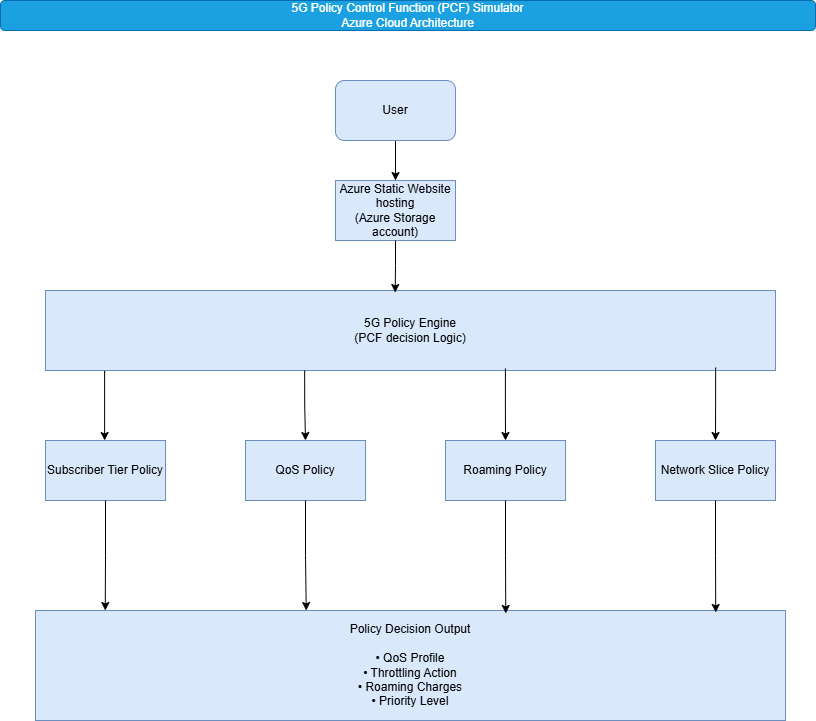
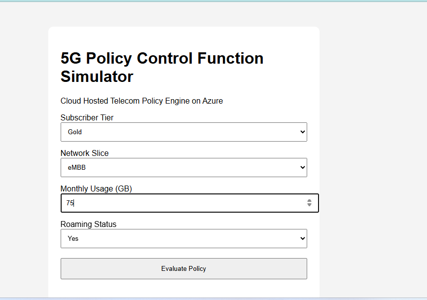
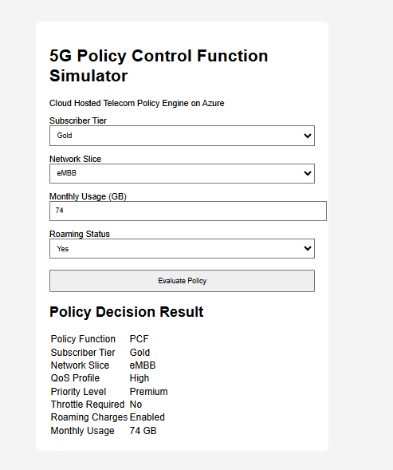
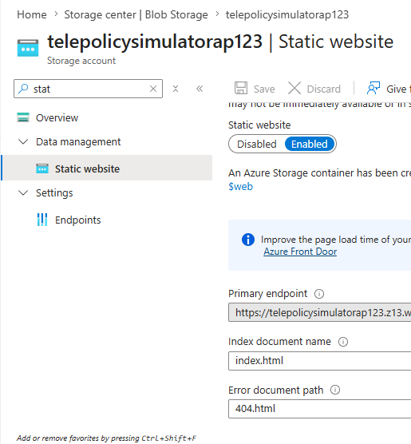
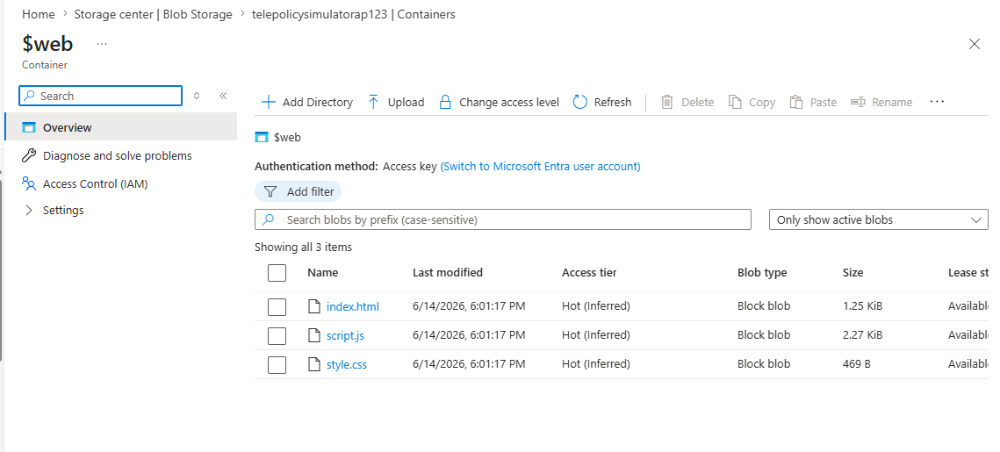

# 5G Policy Control Function (PCF) Simulator

## Overview

The 5G Policy Control Function (PCF) Simulator is a cloud-hosted telecom policy decision engine inspired by real-world 5G core network architectures.

The application evaluates subscriber requests based on:

* Subscriber Tier
* Network Slice
* Monthly Data Usage
* Roaming Status

and generates policy decisions such as:

* QoS Profile Assignment
* Traffic Throttling Decisions
* Roaming Charge Applicability
* Subscriber Priority Levels

The solution is deployed using Azure Static Website Hosting and demonstrates the integration of cloud technologies with telecom domain concepts.

## Architecture Diagram




---

## Azure Services Used

* Azure Storage Account
* Azure Blob Storage
* Azure Static Website Hosting

---

## Features

* Subscriber Profile Evaluation
* QoS Policy Assignment
* Roaming Policy Enforcement
* Network Slice Selection
* Rule-Based Policy Decision Engine
* Cloud Deployment on Azure

---

## Real-World Telecom Mapping

| Simulator Component     | Telecom Network Component     |
| ----------------------- | ----------------------------- |
| Policy Engine           | PCF (5G) / PCRF (4G)          |
| Subscriber Policy Rules | Subscriber Profile Management |
| QoS Policy              | QoS Enforcement Logic         |
| Roaming Policy          | Roaming Charging Rules        |
| Network Slice Policy    | Slice-Specific Policy Control |
| Policy Decision Output  | PCC Rules / Policy Decisions  |

---

## Screenshots

### Application Home Page



### Policy Evaluation Result



### Azure Static Website Hosting



### Azure Deployment Artifacts



---

## Sample Policy Evaluation

**Input**

* Subscriber Tier: Gold
* Network Slice: eMBB
* Monthly Usage: 74 GB
* Roaming Status: Yes

**Output**

* QoS Profile: High
* Priority Level: Premium
* Traffic Shaping: Not Required
* Roaming Charges: Enabled

---

## Project Structure

```text
azure-5g-pcf-simulator/

├── index.html
├── style.css
├── script.js
├── README.md

├── architecture/
│   ├── architecture-diagram.png
│   └── architecture.drawio

└── screenshots/
    ├── homepage.png
    ├── policy-evaluation.png
    ├── azure-static-website.png
    └── web-container.png
```

---

## Future Enhancements

* Azure Functions Integration
* Azure Table Storage for Policy Persistence
* REST API-based Policy Evaluation
* Dynamic Subscriber Profiles
* Multi-Subscriber Dashboard
* AI-assisted Policy Recommendations

---

## Author

Aprajita Mishra

Cloud | Telecom | Azure | 5G Technologies
